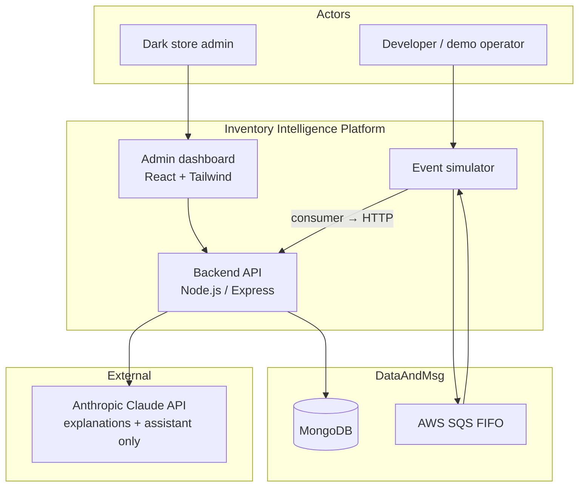
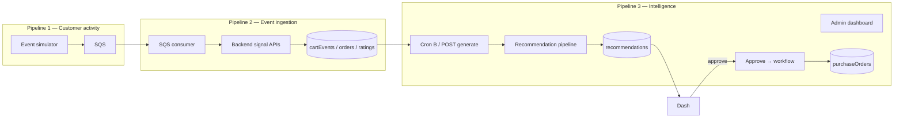
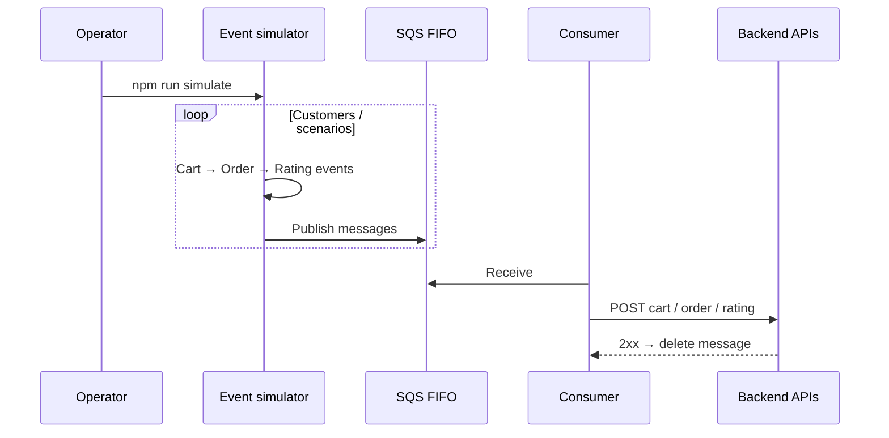
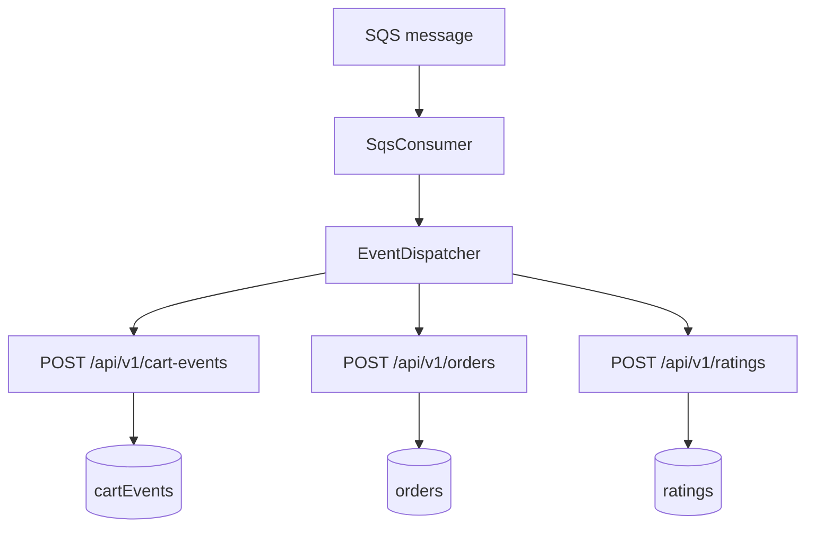
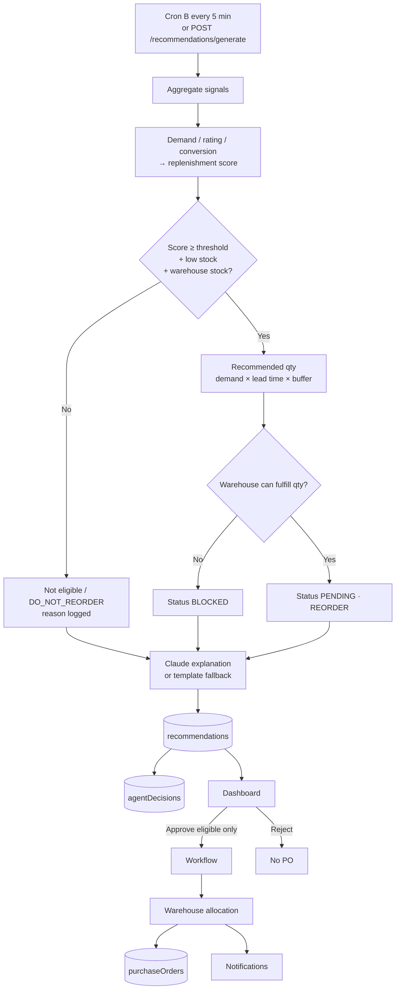
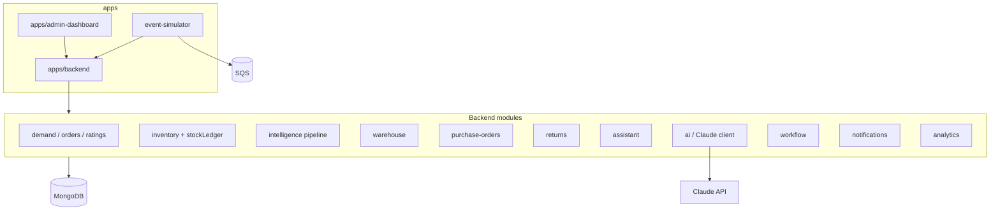
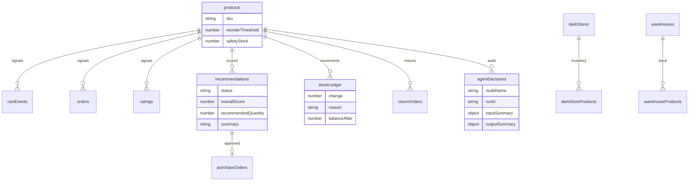
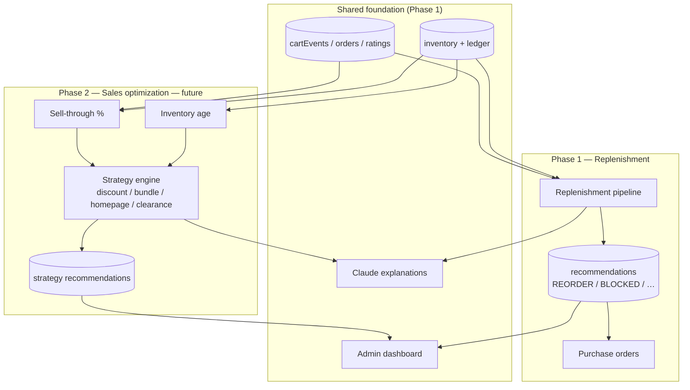
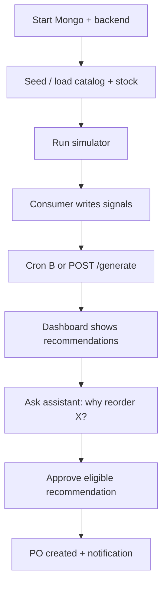

# Phase 1 Architecture — Replenishment Intelligence

This document describes the **Phase 1** architecture of the Agentic Inventory Intelligence Platform: how operational signals become explainable reorder recommendations, and how admins approve purchase orders. It also shows where **Phase 2 (Sales Optimization)** plugs in without changing Phase 1’s core loops.

---

## 1. System context



**Boundaries**

| Concern | Phase 1 | Phase 2 |
|--------|---------|---------|
| Primary question | Should we reorder from the warehouse? | This isn’t selling — what strategy? |
| Decision math | Deterministic scoring + rules | Deterministic sell-through / strategy table |
| LLM role | Explain decisions + read-only chat | Explain strategy recommendations the same way |
| Scope | Single dark store ↔ one main warehouse | Same store; no multi-store transfers yet |

---

## 2. High-level Phase 1 architecture



These three pipelines are **independent**:

1. **Simulator** creates synthetic demand (no real customers).
2. **Ingestion** persists append-friendly signal history.
3. **Intelligence** reads Mongo signals on a schedule (or manually), scores products, and surfaces actions — **it does not consume SQS**.

---

## 3. Pipeline 1 — Event generation (simulator)



**Notes**

- Scenarios (e.g. high demand, poor rating / MacBook pattern) live in `event-simulator/`.
- **Cron A** (`npm run cron:simulator`, every 1 minute) continuously publishes synthetic customer events to SQS. The consumer must run in parallel (`npm run queue:consumer`, batch size 10).
- Message grouping by product supports per-product ordering when used for scoring jobs later; today SQS primarily carries **ingestion** events.

---

## 4. Pipeline 2 — Event ingestion



After this stage, Mongo holds **historical signals only**. No recommendations are created here.

---

## 5. Pipeline 3 — Replenishment intelligence (Phase 1 core)



### Deterministic scoring (LLM never computes numbers)

```
demand_score       ← cart-add volume (normalized 0–1)
conversion_score   ← purchases ÷ cart adds
rating_score       ← avg rating / 5

replenishment_score = 0.4·demand + 0.3·rating + 0.3·conversion
                      (weights sum to 1.0)

eligible if score ≥ THRESHOLD (0.6)
         and store stock is low
         and warehouse has stock
```

### Orchestration modules

| Step | Module |
|------|--------|
| Aggregate | `signal-aggregator.service` |
| Gate | `eligibility.service` |
| Rules | `recommendation.rules` / `recommendation.service` |
| Qty | `calculateReorderQuantity` in `scoring.ts` |
| Explain | `explanation.service` → Claude + templates |
| Persist | `recommendation-persistence.service` |
| Audit | `agent-decision.service` |
| Schedule | `recommendation.scheduler` (Cron B) |
| Approve path | `workflow.service` → allocation → PO |

---

## 6. Runtime component view



---

## 7. Data stores (Phase 1)



**Primary collections**

| Collection | Role |
|------------|------|
| `cartEvents`, `orders`, `ratings` | Customer signals |
| `darkStoreProducts`, `warehouseProducts` | Current stock state |
| `stockLedger` | Append-only inventory history |
| `recommendations` | Actionable / blocked / historical decisions |
| `agentDecisions` | Per-node pipeline audit |
| `purchaseOrders` | Admin-executed replenishment |
| `returnOrders` | Near-expiry / excess return-to-warehouse |
| `notifications` | Workflow events |

---

## 8. Admin & assistant surfaces

```mermaid
flowchart LR
  Admin --> RecUI[Recommendations<br/>generate / approve / reject]
  Admin --> POUI[Purchase orders]
  Admin --> InvUI[Inventory]
  Admin --> Chat[AI assistant<br/>read-only tools]
  RecUI --> API[/api/v1/recommendations]
  Chat --> Asst[/api/v1/assistant/chat]
  Asst --> Tools[Tools: recommendations,<br/>inventory, ledger, decisions, POs]
  Tools --> Mongo[(MongoDB)]
```

- Assistant is **read-only** — cannot create POs or mutate inventory.
- Claude **explains**; all scores and quantities remain deterministic.

---

## 9. Where Phase 2 attaches

Phase 2 does **not** replace Pipelines 1–3. It adds a parallel **sales optimization** intelligence path that reuses the same signals, dashboard, and explanation pattern.



### Phase 2 strategy bands (planned)

| Sell-through % | Interpretation | Strategy |
|----------------|----------------|----------|
| 90–100% | Excellent | Continue normal pricing |
| 70–90% | Good | Monitor |
| 40–70% | Slow moving | Homepage highlight |
| 20–40% | Poor | Discount or bundle |
| &lt;20% | Dead stock | Aggressive clearance |

### Explicitly deferred past Phase 2

- Multi-store transfer recommendations  
- Real external supplier integrations  
- Production multi-tenant auth / mobile app  

---

## 10. End-to-end Phase 1 demo path



**Operator commands (typical local flow)**

```bash
docker compose up -d          # Mongo
npm run dev                   # Backend (+ Cron B)
npm run simulate              # Pipeline 1
npm run queue:consumer        # Pipeline 2
# Pipeline 3: wait for Cron B, or:
curl -X POST http://localhost:3000/api/v1/recommendations/generate -H 'Content-Type: application/json' -d '{}'
npm run dev:dashboard         # Admin UI + assistant
```

---

## 11. Non-functional guarantees (Phase 1)

| Principle | How it is enforced |
|-----------|-------------------|
| Correctness over cleverness | Scores, thresholds, qty in TypeScript; unit-tested |
| Explainability | Every recommendation has `summary` + `factors` |
| Auditability | `agentDecisions` + `stockLedger` + recommendation history |
| No autonomous spending | Only admin approve creates a PO |
| Idempotent regenerations | Pending recs expired before new ones for same product/store |
| Scheduler safety | Cron B skips if previous tick still running |

---

## Related docs

- [Architecture index](./README.md)
- [Database schema](../database/database-schema.md)
- [PRD index](../PRD/README.md)
- [Diagrams index](../diagrams/README.md)
